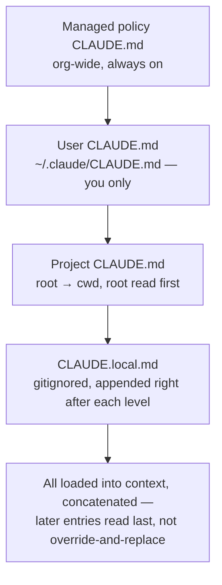

# 3.1 — CLAUDE.md hierarchy, scoping, and `@import`

This is a configuration mechanism, not an API call — there's nothing to run
here, only a load order to get right. The example files under
[`../examples/claude_md/`](../examples/claude_md/) show the actual syntax;
this page shows the order they'd load in and the one failure mode the exam
names explicitly.

## Load order

Broadest scope to narrowest — a later entry in this table is read **after**
the ones above it, so it can reinforce or override what came before:

| Scope | Location | Shared with |
|---|---|---|
| Managed policy | `/etc/claude-code/CLAUDE.md` (or platform equivalent) | Everyone in the org — cannot be excluded |
| User | `~/.claude/CLAUDE.md` | Nobody. Personal, machine-local, **never** reaches teammates via version control |
| Project (root → cwd) | `./CLAUDE.md` or `./.claude/CLAUDE.md`, at every directory from the filesystem root down to where you launched Claude | Team, via git |
| Local | `./CLAUDE.local.md` | Nobody — gitignored, personal-per-project |



Subdirectory `CLAUDE.md` files are the one exception to "loaded at launch" —
they load **on demand**, only when Claude reads a file in that subdirectory,
not up front.

## `@import`

```
See @package.json.example for available npm commands.
- git workflow @docs/git-instructions.md.example
```

— from [`root_CLAUDE.md.example`](../examples/claude_md/root_CLAUDE.md.example).
Two rules worth holding onto:

- **Relative paths resolve against the file doing the importing**, not your
  working directory. `@docs/git-instructions.md.example` in that file
  resolves to `examples/claude_md/docs/git-instructions.md.example` — a
  mistake here (writing the file at the wrong nesting level) is exactly the
  kind of bug that stays invisible until you actually try to load it.
- **Imports recurse up to 4 hops**, then stop. An import chain deeper than
  that silently truncates.

## The exam's named failure: "my teammate isn't getting instructions"

The diagnosis is almost always the same shape: the instruction lives in
`~/.claude/CLAUDE.md` (user-level) instead of `./CLAUDE.md` (project-level).
It works perfectly for the person who wrote it — their own sessions load it
every time — and silently does nothing for anyone else, because user-level
files never travel through git. There's no error, no warning; the instruction
just isn't in a teammate's context because it was never meant to be.

**How to actually check**, rather than argue about it: run `/context` in a
session and read the **Memory files** list. If the file you expect isn't
there, it didn't load — full stop, regardless of what you believe you wrote
where. `/memory` opens the files directly if you need to edit them.
