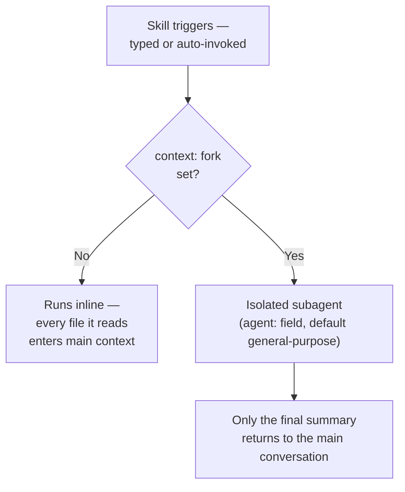

# 3.2 — Custom slash commands and skills

## Commands vs skills

| | Slash command (`.claude/commands/*.md`) | Skill (`.claude/skills/*/SKILL.md`) |
|---|---|---|
| Invocation | Explicit only — you type `/name` | Explicit (`/name`) **or** auto-invoked when Claude judges the `description` matches your prompt |
| Frontmatter | None — the file body *is* the prompt | Full schema below |
| Project-scoped location | `.claude/commands/` — shared via git | `.claude/skills/<name>/` — shared via git |
| Personal location | `~/.claude/commands/` — you only | `~/.claude/skills/<name>/` — you only |

[`examples/claude_commands/review.md.example`](../examples/claude_commands/review.md.example)
is the project-scoped case from the exam's own sample question: a `/review`
command in `.claude/commands/`, version-controlled, available to every
developer the moment they clone the repo — not `~/.claude/commands/`, which
is personal and invisible to teammates.

## `SKILL.md` frontmatter — the fields this domain actually tests

| Field | Type | What it does |
|---|---|---|
| `description` | string | What Claude reads to decide whether to auto-invoke. No description = command-only, never auto-triggered |
| `argument-hint` | string | Autocomplete hint, e.g. `"[topic]"` — **must be quoted**; see the footgun below |
| `context: fork` | string | Runs the skill in an isolated subagent instead of the main conversation |
| `agent` | string | Which subagent type to fork into when `context: fork` is set — defaults to `general-purpose` if omitted |
| `allowed-tools` | string/list | Tools pre-approved for the skill's own turn, no permission prompt |

[`examples/claude_skills/deep-research/SKILL.md.example`](../examples/claude_skills/deep-research/SKILL.md.example)
uses all four together — `context: fork` with `agent: Explore`, so a research
task runs in an isolated `Explore` subagent and only its final summary
reaches the main conversation.

## A real bug this quoting rule caught

`argument-hint: [topic]` — unquoted — parses as a one-item **YAML list**
(`['topic']`), not the literal string `"[topic]"` shown in the docs. YAML
treats unquoted square brackets as flow-sequence syntax. Parsing this repo's
own `deep-research/SKILL.md.example` with `yaml.safe_load` surfaced it
directly: `argument-hint` came back as a `list`, not a `str`. Fixed by
quoting: `argument-hint: "[topic]"`.

## Skills vs. CLAUDE.md — the actual decision

| | CLAUDE.md | Skill |
|---|---|---|
| Cost | Every session, whether needed or not | Zero, until triggered |
| Right for | Universal standards — build commands, "always do X" | Task-specific workflows — only some prompts need it |

Putting a rarely-needed procedure in CLAUDE.md means paying its token cost on
every single turn of every session, forever, for a capability most of those
turns never use. A skill pays that cost only on the turns that actually
invoke it.
