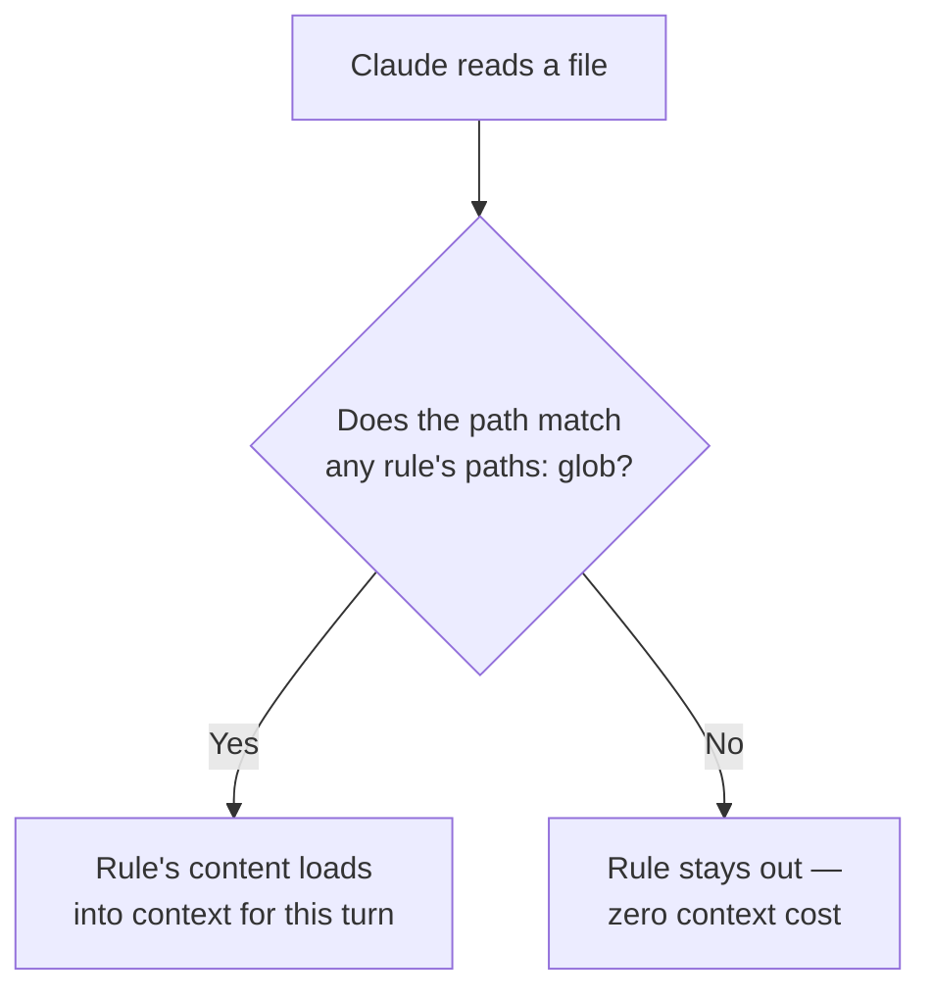

# 3.3 — Path-specific rules for conditional convention loading

`.claude/rules/*.md` files without a `paths:` field load unconditionally —
same priority as `CLAUDE.md`, every session. **With** a `paths:` field (a
YAML list of glob patterns), a rule loads only when Claude reads a file that
matches one of those patterns.

## The exam's own two named patterns

Both live in [`examples/claude_rules/`](../examples/claude_rules/) exactly as
written:

| File | `paths:` | Matches | Doesn't match |
|---|---|---|---|
| [`terraform.md.example`](../examples/claude_rules/terraform.md.example) | `terraform/**/*` | `terraform/modules/vpc/main.tf` | `src/config.tf` (wrong directory) |
| [`testing.md.example`](../examples/claude_rules/testing.md.example) | `**/*.test.tsx`, `**/*.test.ts` | `src/components/Button.test.tsx`, and a root-level `App.test.tsx` too — `**` matches zero-or-more directories | `src/components/Button.tsx` (not a test file) |

## Why glob rules beat a subdirectory `CLAUDE.md` here

The failure mode a subdirectory `CLAUDE.md` can't solve: test files in this
codebase sit next to the code they test — `Button.test.tsx` beside
`Button.tsx` — scattered across every component directory, not concentrated
in one `tests/` folder. A directory-level `CLAUDE.md` only ever covers *one*
directory tree; to reach every test file with that mechanism you'd need to
duplicate the same instructions into every directory that contains a
component. One glob-pattern rule, matching by file *type* rather than
*location*, covers all of them from a single file.
