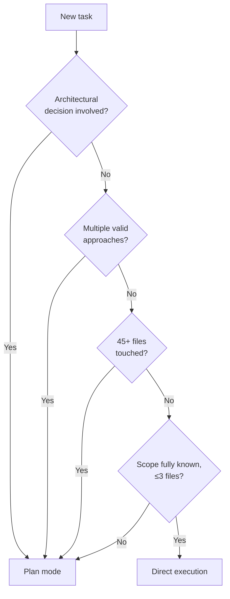

# 3.4 — Plan mode vs. direct execution

This half is a decision to make before touching any code, so it's a decision
tree, not something to run. The Explore-subagent half of Task 3.4 — an actual
live capability, not a static rule — stays in
[`../task_3_4_explore_subagent.py`](../task_3_4_explore_subagent.py).

Any single "yes" on the left routes to plan mode — the conditions don't need
to co-occur. A 45-file migration with only one sane approach still needs it;
so does a 3-file change where the *right* architecture is genuinely unclear.

| | Plan mode | Direct execution |
|---|---|---|
| Exam's own example | Microservice restructuring, a library migration touching 45+ files, choosing between integration approaches | A single-file bug fix with a clear stack trace, adding a date-validation conditional |
| What it buys you | Safe exploration and design *before* committing to changes — catches an architectural mistake by re-reading a plan, not by reverting a half-finished migration | No ceremony, because there's nothing left to decide |

They compose, too: plan mode for the investigation phase, then switch to
direct execution once the approach is settled — planning *how* to migrate a
library, then actually doing it.
